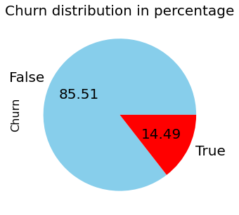
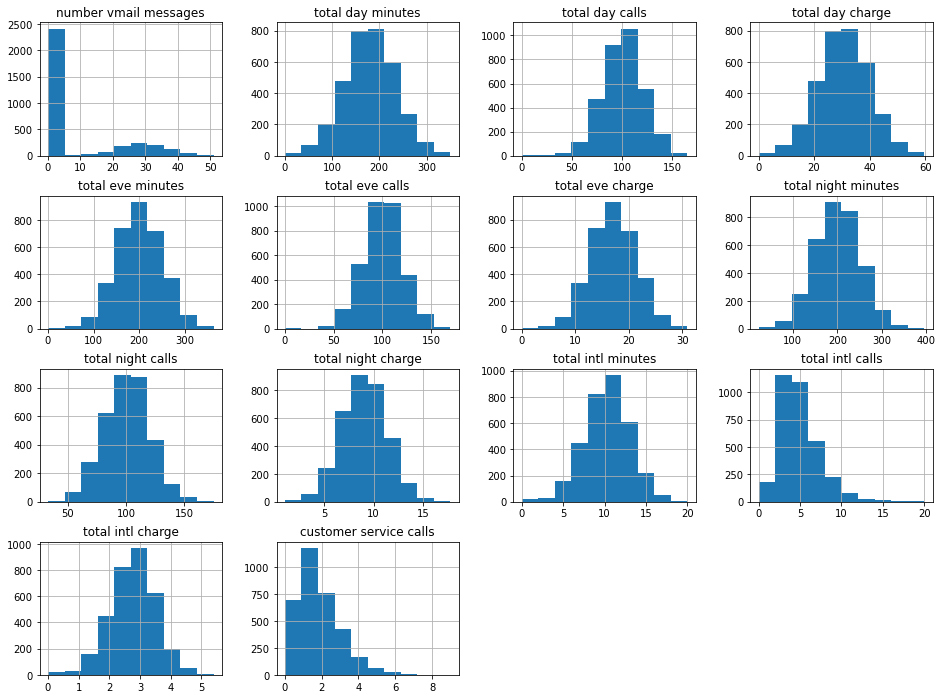
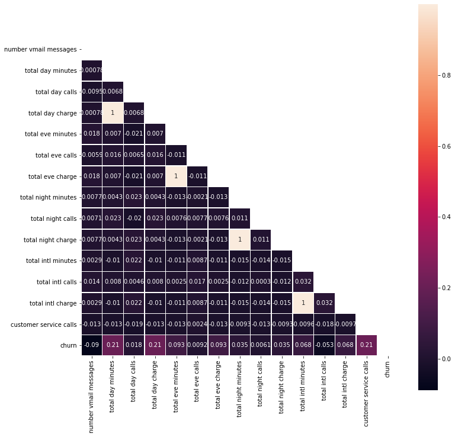
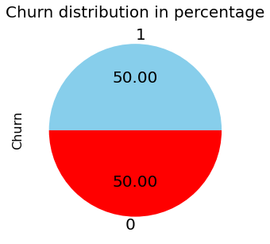
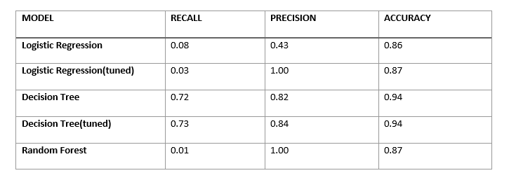

# SyriaTel Customer Churn Classifier.
## Overview.
SyriaTel, a major mobile operator in Syria with extensive services and infrastructure, is a key stakeholder in my project. Together, we will analyze customer data to identify patterns and trends, focusing on reducing customer churn and improving overall satisfaction. Through close collaboration, I hope to help SyriaTel optimize its strategies and succeed in the telecommunications industry. To achieve this, I will develop a predictive model to assess customer behavior and prevent attrition. Ultimately, this project is essential for enhancing customer satisfaction and reducing revenue loss.

## Exploratory Data Analysis
The dataset used for this project is the customer churn data from Syriatel, a telecommunications company in Syria. There is a class imbalance problem since the target class has an uneven distribution of observations. 85.51% of the data belongs to the False class while 14.49% belongs to the true class.
()

The scaling differs across the features, and a few of the features are not normally distributed. The features will therefore have to be scaled and normalized.

There is a very low correlation between most features.
However, there is a perfect positive correlation between total evening charge and total evening minutes, total day charge and total day minutes, total night charge and total night minutes, and total international charge and total international minutes. This is expected since the charge of a call depends on the length of the call in minutes. One correlated variable will have to be dropped from each pair to handle multicollinearity.
total day minutes, total day charge and customer service calls have a weak positive correlation with churn.
The other features have a negligible correlation with churn, approximately 0.

## Data Preparation For Machine Learning
Multicollinearity of features: columns showing total charge at different times are dropped to address the multicollinearity
Train-test split: Data is split into train and test sets.
Transform categorical variables: dummy variables are created for categorical features.
SMOTE: SMOTE is used to handle class imbalance problems by oversampling the minority class with replacement.
The pie chart below shows the distribution of target variable after applying SMOTE.

## Model Building & Evaluation
Logistic Regression model was chosen as it has good performance on binary classification tasks.
Other models were created too. that is Desicion tree, and Random Forest models.
The image below shows a summary of the models and their performance.

Decision tree with tuned hyperparameters is the model with the best performance. It has the highest precision score. The accuracy and recall scores are above average.

# Conclusions and Recommendations
Based on the results from exploratory data analysis and machine learning evaluation, we can conclude that Decision tree with tuned hyperparameters performed best among all models in terms of precision, recall and accuracy.
Here are some of the reccommendations for the business.
### 1. Personalized Marketing Campaigns: 

Implement personalized marketing strategies for different customer segments. Use the insights from the model to target at-risk customers with tailored promotions, discounts, or incentives to encourage them to stay.

### 2. Customer Feedback Loop:

Establish a feedback loop to gather insights from churned customers. Understand their reasons for leaving and use this feedback to improve your services or address common pain points.

### 3. Enhance Customer Support: 

Improve the quality and responsiveness of customer support. Ensure that customer issues are resolved quickly and satisfactorily. Utilize the model to identify high-risk customers and prioritize their support needs.

### 4. Product or Service Enhancements: 

Continuously assess and enhance the quality of your products or services. Use the model to identify patterns in customer behavior and preferences, which can guide product development and improvements.

### 5. Subscription Plan Adjustments: 

Consider offering flexible subscription plans or pricing options. Some customers may be churning due to cost concerns or underutilization of certain features. Tailor plans to better match individual customer needs.

### 6. Retention Offers: 

Develop retention offers for customers at high risk of churning. These could include extended trial periods, loyalty rewards, or exclusive access to new features. Make these offers visible to the identified customers.

### 7. Competitor Analysis: 

Keep an eye on competitors and what they are offering. Understand why customers may be switching to competitors and adapt your strategies accordingly.

### 8. Monitor Customer Behavior: 

Continue to monitor customer behavior and adjust your strategies accordingly. The predictive model should be regularly updated with new data to maintain its accuracy.

### 9. Data Security and Privacy: 

Assure customers of data security and privacy. This is particularly important in industries where data security is a concern. Clearly communicate your commitment to safeguarding customer data.